<!-- _class: lead -->

# **#sig-crypto**

『クラウドを支えるこれからの暗号技術』
4.6 - 4.10

2021/06/24 (木)

うら (@n4o847)

---

### 今日の内容

- デジタル署名
  - RSA-FDH 署名
  - DSA
- ブラインド署名
- 秘匿共通集合計算
- 部分ブラインド署名

---

### 4.6　デジタル署名

あるメッセージがその作者によって作られたことを検証する仕組み。

---

### 4.6　デジタル署名

ここで RSA 暗号を思い出してみる。

メッセージ $m$、公開鍵 $K'$、秘密鍵 $K$ として
$$
\operatorname{Dec}(K, \operatorname{Enc}(K', m)) = m.
$$

具体的にはそれぞれ
$$
\operatorname{Enc}(K', m) := m ^ {K'} \bmod n, \\
\operatorname{Dec}(K, c) := c ^ K \bmod n.
$$

よって $K$ と $K'$ を逆にしても等式が成り立つ。

$$
\operatorname{Dec}(K', \operatorname{Enc}(K, m)) = m.
$$

---

### 4.6　デジタル署名

RSA 暗号の秘密鍵と公開鍵を逆に使うことで、

- 暗号化できるのは秘密鍵を持っている人だけ
- 複合は公開鍵を使って誰でもできる

という性質が得られる。デジタル署名の言い方で言い換えれば

- **署名**できるのは**署名鍵**を持っている人だけ
- **検証**は**検証鍵**を使って誰でもできる

となる。

MAC は秘密鍵を共有する必要があったが、デジタル署名はその必要がなくなる！

---

### 4.6　デジタル署名

具体的に以下の方法を見ていく。

- RSA-FDH (FDH: Full Domain Hash) 署名
  - 式が簡単なのでまずはこれから
- DSA (Digital Signature Algorithm)
  - 現在標準的に使われている

---

### 4.6.1　RSA-FDH 署名

**鍵生成**　公開鍵 $(n, e)$、秘密鍵 $d$、Full Domain ハッシュ関数 $H$ を用意する。
　<small>(Full Domain: ハッシュ値が $n$ と同じサイズになること)</small>

**署名**　メッセージ $m$、秘密鍵 $d$、署名 $s$ として
$$
s := H(m)^d \bmod n.
$$

**検証**　メッセージ $m$、署名 $s$ として
$$
H(m) \equiv s^e \pmod n.
$$

 

<small>ハッシュ関数の値域が $n$ と同じビット数必要なので、あまり効率がよいとはいえない。</small>

---

### 4.6.2　DSA

**鍵生成**　ハッシュ関数 $H$、DH パラメータ $(p, q, g)$ を決める。
　$p$ は大きな素数、$q$ はハッシュ関数の出力と同じサイズ。
　$g$ は生成元で $g^q \equiv 1 \bmod p$。$p - 1$ は $q$ で割り切れる。
　$0 < x < q$ となる $x$ をランダムに選び、$y := g^x \bmod p$ とする。
　$(g, p, q, y)$ が公開鍵で $x$ が秘密鍵。

**署名**　メッセージ $m$ に対して整数 $k$ をランダムに選び $r := (g^k \bmod p) \bmod q$ とする。
$$
s := (H(m) + xr) / k \bmod q
$$
を計算し $(r, s)$ を署名とする。

---

### 4.6.2　DSA

**検証**　署名 $(r, s)$ について最初に $0 < r, s < q$ を確認する。
　メッセージ $m$ に対して
$$
\begin{align*}
&w := s^{-1} \bmod q, & &u_1 := H(m) w \bmod q \\
&u_2 := rw \bmod q, & &v := (g^{u_1}y^{u_2} \bmod p) \bmod q
\end{align*}
$$
　を求めて $v = r$ かどうか。

確認
$$
\begin{gather*}
w = s^{-1} = k/(H(m) + xr) \\
g^{u_1}y^{u_2} = g^{H(m)w}(g^x)^{rw} = g^{(H(m)+xr)w} = g^k = r
\end{gather*}
$$

---

### 4.7　ブラインド署名

署名者がどんなメッセージに署名しているか知らないままで署名させる。

---

### 4.7　ブラインド署名

**鍵生成**　B は RSA-FDH 署名の署名鍵 $d$ と検証鍵 $(n, e, H)$ を用意する。

**ブラインド**　A はメッセージ $m$ に対して乱数 $r$ を選んで $x$ を計算して B に渡す。
$$
x := \operatorname{Blind}(m) := r^e H(m) \bmod n.
$$

**署名**　B は $x$ に対して署名 $y$ を計算して A に返す。
$$
y := \operatorname{Sign}(x) := x^d \bmod n.
$$

**アンブラインド**　A は $y$ からメッセージ $m$ に対する B の署名 $s$ を計算する。
$$
s := \operatorname{Unblind}(y) := y/r \bmod n.
$$

---

### 4.7　ブラインド署名

確認
$$
y \equiv x^d \equiv (r^e H(m))^d \equiv r^{ed}H(m)^d \equiv rH(m)^d \bmod n
$$
なので
$$
s \equiv y/r \equiv H(m)^d \bmod n
$$
となり、これは $m$ に対する RSA-FDH 署名になっている。

---

### 4.8　秘匿共通集合計算

あるデータの集合に対して A さんと B さんがそれぞれその部分集合を持っている
とき、お互いに何を持っているのか秘密にしたまま共通する要素を特定する。

---

### 4.8　秘匿共通集合計算

---

### 4.8　秘匿共通集合計算

なぜ単に $H(b_j)$ を渡すだけではだめなのか？
- $b_j$ の予想できる種類が多くないとき、A は手当たり次第に $H(b_k)$ を試して
  $b_j'$ と比較することで $b_j$ が分かってしまう

 

問題点
- B は共通部分の情報を得られず、A と B の立場が対等ではない
- このプロトコルを複数回行うと、A は B の集合の何番目の要素が変化したかを
  知ることができる

---

### 4.9　部分ブラインド署名

ブラインド署名は署名者がどんなメッセージに署名をしているかわからない

メッセージの一部を両者が共有することで署名者が署名してよいかどうかを
判断できるようにした方式

---

### 4.9　部分ブラインド署名

1. $(p, q, g)$ を DH パラメータとする。$p$ と $q$ は $p-1$ が $q$ の倍数となる素数で $g^q = 1 \bmod p$ である。B は秘密鍵 $x$ を決めて $y := g^x \bmod p$ を公開鍵とする。更にハッシュ関数 $H$ を決める。
2. B は $m'$ を確認してブラインド署名することに決める。整数 $u, s, d$ をランダムに選ぶ。$z := H(m'), a := g^u, b := g^sz^d$ を計算して $(a, b)$ を A に送る。
3. A は $z = H(m')$ を確認し、整数 $t_1, t_2, t_3, t_4$ をランダムに選び
   $$
   \alpha := ag^{t_1}y^{t_2},\ \beta := bg^{t_3}z^{t_4},\ \epsilon := H(\alpha, \beta, z, m),\ e := \epsilon - t_2 - t_4
   $$
   を計算して $e$ を B に送る。

(続く)

---

### 4.9　部分ブラインド署名

4. B は $c := e-d, r := u-cx$ を計算し A に $(r, c, s, d)$ を送る。
5. A は $\rho := r + t_1, \omega := c+t_2, \sigma := s+t_3, \delta := d+t_4$ を計算し $(\rho, \omega, \sigma, \delta)$ を $m$ に対する署名とする。
6. 署名の検証は
   $$
   \omega + \delta \overset{?}{=} H(g^\rho y^\omega, g^\sigma z^\delta, z, m)
   $$
   が成立するかどうかで判定する。

(終わり)

---

### 4.9　部分ブラインド署名

確認

$$
\begin{gather*}
\omega + \delta = c + t_2 + d + t_4 = e - d + t_2 + d + t_4 = (\epsilon - t_2 - t_4) + t_2 + t_4 = \epsilon, \\
g^\rho y^\omega = g^{r + t_1} (g^x)^\omega = g^{(u-cx)+t_1+cx+t_2x} = g^{u+t_1+t_2x} = g^u g^{t_1} g^{t_2} = \alpha, \\
g^{\sigma} z^{\delta} = g^{s+t_3} z^{d+t_4} = (g^s z^d) g^{t_3} z^{t_4} = \beta, \\
H(g^\rho y^\omega, g^\sigma z^\delta, z, m) = H(\alpha, \beta, z, m) = \epsilon
\end{gather*}
$$

---

### 終わり

- CryptoHack
  - RSA > Signatures Part 1, Signatures Part 2
    https://cryptohack.org/challenges/rsa/
